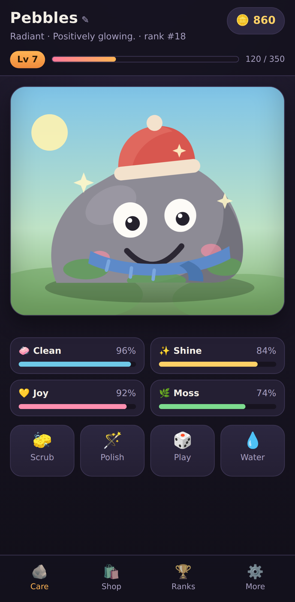
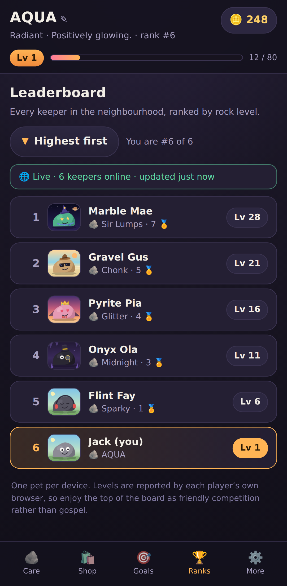
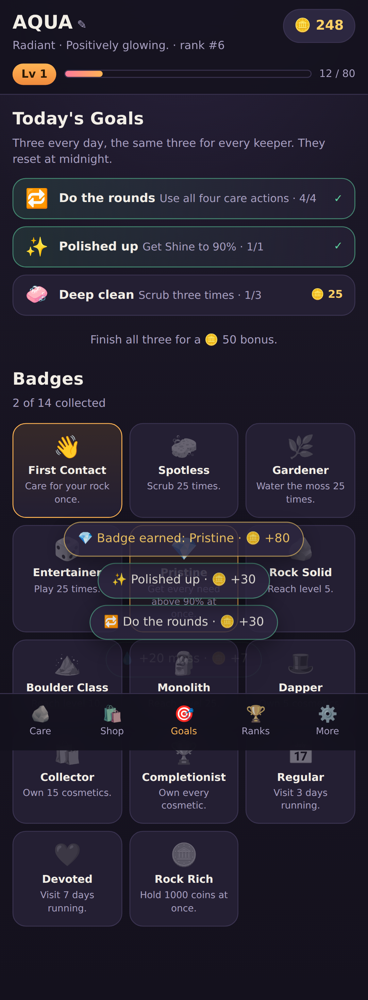

# 🪨 Pet Rock Simulator

A digital pet — but it's a rock. Scrub it, polish it, play with it and water its
moss. Look after it and it levels up; forget about it and it levels right back
down. Earn coins, dress it up in the boutique, and see where you land on the
leaderboard.

It's a **PWA**: one small web app that installs to the home screen or desktop on
**Windows, Android and iOS**, and keeps working with no connection. Point it at a
free Supabase project and every player shares one live worldwide leaderboard.

<p align="center">
  
  
  
</p>

---

## Install it

The app has to be served over **https** (or `localhost`) to be installable —
GitHub Pages is the easy option, see [Deploying](#deploying) below. Once it's at
a URL:

| Platform | How |
| --- | --- |
| **Android** (Chrome, Edge, Samsung Internet) | Open the URL → tap the **Install** button in the app's *More* tab, or browser menu ⋮ → **Install app / Add to Home screen**. |
| **iPhone / iPad** (Safari — required, Chrome and Firefox on iOS can't install web apps) | Open the URL in **Safari** → **Share** ⬆️ → **Add to Home Screen** → **Add**. |
| **Windows** (Chrome, Edge) | Open the URL → click the **install icon** in the address bar, or menu ⋮ → **Apps → Install this site as an app**. It gets its own window and a Start-menu entry. |
| **macOS / Linux** (Chrome, Edge) | Same as Windows — install icon in the address bar. |

Installed, it launches full screen, keeps its own save, and runs offline. Your
rock keeps ageing while the app is closed, so it will need attention when you
come back.

## How to play

**Four needs** drain continuously — in real time, whether the app is open or not:

| Need | Action | Drains |
| --- | --- | --- |
| 🧼 Clean | 🧽 Scrub | 4.5 %/hour |
| ✨ Shine | 🪄 Polish | 5.0 %/hour |
| 💛 Joy | 🎲 Play | 5.5 %/hour |
| 🌿 Moss | 💧 Water | 3.5 %/hour |

**Levels go up and down.** Your care score is the average of the four needs.
Above 55 % the rock gains XP and levels up; below it, XP drains and levels are
lost. Perfect care is +30 XP/hour, total neglect is −14 XP/hour. Coming back
after days away costs at most 24 hours' worth of damage, so a holiday won't wipe
you out — but it will hurt.

**Coins** come from care actions (only for points actually restored — spamming a
full bar earns nothing), from every level-up, and from a daily check-in streak.

**Cosmetics** — 30 items across five slots: rock types, eyes, hats, extras and
scenes. Buy once, wear forever, swap any time. Expensive items also need a
minimum level.

**Daily goals and badges** — three quests every day, the same three for every
keeper, worth coins individually and a bonus for sweeping all three. Fourteen
badges track the longer arcs: levels, collections, streaks and a perfectly kept
rock. Both live on the **Goals** tab.

**Leaderboard** — every keeper ranked by level, each row drawing that player's
actual rock with the cosmetics they bought and the scene they chose, plus their
badge count. A button flips between **highest first** and **lowest first**, and
your own row is highlighted wherever it lands. Sign in and it is a live
worldwide board; play without an account and you face simulated rivals instead.

## Online leaderboard

> **New here?** [SETUP.md](SETUP.md) walks the whole thing end to end —
> backend, deploy, and checking multiplayer works — in about 10 minutes.

This repo is already pointed at a Supabase project, so everyone who opens the
deployed site shares one board with nothing to configure. The game also runs
perfectly well with the `SUPABASE` block in [`js/config.js`](js/config.js) left
empty — it just plays against simulated rivals instead.

To point it at your own project: create one at
[supabase.com](https://supabase.com), run [`supabase/schema.sql`](supabase/schema.sql)
in its SQL editor, then put the project URL (always `https://<ref>.supabase.co`)
and its **`anon` / public** key into `SUPABASE`. [SETUP.md](SETUP.md) has the
detail, including where the dashboard hides each value. To try a project before
committing keys, use **More → Connect Supabase** in the app — that saves on one
device only.

**Accounts.** The first run on a device offers a username and password, or a
sign-in. One account owns one rock, and signing in on a phone, a laptop or a
friend's browser brings that same rock with it. The username is what other
keepers see on the board. Declining is allowed — the game then runs purely
locally against simulated rivals, and the offer stays available under **More**.

Passwords are only ever stored as bcrypt hashes (`pgcrypto`), never in the
clear, and are never readable by any client. A device keeps a session token,
which the server holds only as a SHA-256 hash and can expire or revoke. Five
wrong guesses lock an account for fifteen minutes, and a wrong username and a
wrong password give the same message, so the form cannot be used to discover who
has an account.

Two devices on one account converge on whichever save was played most recently
rather than clobbering each other; progress is pushed on a short cooldown, so
expect a few seconds of lag when hopping between devices.

**About the anon key.** It's public by design — it names the project, it doesn't
grant access. What actually protects the data is in `schema.sql`: row level
security allows `SELECT` only, column grants keep password hashes and save blobs
unreadable, session rows are invisible to every client, and every write goes
through a `SECURITY DEFINER` function that checks a password or a session token
and clamps whatever it is given. Committing the anon key is expected. Never put
the `service_role` key in this repo.

**What it can't do.** Levels are reported by each player's own browser, so a
determined player can post a level they didn't earn — the server clamps the
range and enforces one row per device, but it can't referee the game. Stopping
that properly means simulating the rules server-side, which this doesn't do.
Treat the top of the board as friendly competition.

**When the network is away.** Nothing blocks on it. A failed fetch shows a plain
"⚠️ … showing practice rivals" line, the game keeps playing, and your pet is
republished as soon as the connection returns.

## Run it locally

```bash
npm start          # http://localhost:8080  (no dependencies)
```

Opening `index.html` straight off disk mostly works, but service workers and the
manifest need a real origin, so use the dev server for anything install- or
offline-related.

```bash
npm test           # 49 unit tests: game rules, goals, online layer
npm run icons      # regenerate the PNG icon set (needs python3)
npm run mock       # a stand-in Supabase on :8081, for offline development
npm run test:e2e   # drives two browsers against the mock (needs: npm i -D playwright)
```

`npm test` has no dependencies at all. The end-to-end test does need Playwright,
which is why it is a separate script: it opens two browser contexts as two
devices and checks the whole account flow: registering, signing in elsewhere and
finding the same rock, wrong passwords and taken usernames, that a player who
started before accounts existed keeps their progress, that the board draws
everyone's cosmetics, and that losing the backend falls back to practice rivals
without breaking the game.

## Deploying

`.github/workflows/pages.yml` runs the tests and publishes the repo to GitHub
Pages on every push to the default branch. It needs one manual step first,
because the Pages source can only be set by a repository admin:

1. **Settings → Pages → Build and deployment → Source: _GitHub Actions_**
   ([direct link](https://github.com/Jack-O-VScode/My-Game/settings/pages))
2. Push anything (or **Actions → Deploy to GitHub Pages → Run workflow**).

The site then goes live at **https://jack-o-vscode.github.io/My-Game/** —
public, free, HTTPS, no server to run. Every path in the app is relative, so
serving from a `/My-Game/` subdirectory works fine.

**Custom domain:** buy a domain, point a `CNAME` record at
`jack-o-vscode.github.io`, and set it under Settings → Pages → Custom domain.
Leave *Enforce HTTPS* on — installing a PWA requires it.

Any static host works just as well — Netlify, Vercel, Cloudflare Pages, S3 —
since there is no build step and no backend. Drag the folder into
[app.netlify.com/drop](https://app.netlify.com/drop) and it's online in seconds.

## Layout

```
index.html              markup shell
styles.css              one dark theme, mobile first
manifest.webmanifest    PWA metadata (name, icons, colours)
sw.js                   service worker: precaches the shell for offline play
js/
  config.js             tuning constants, cosmetics catalogue, Supabase keys
  engine.js             pure game rules: decay, XP, levels, coins, shop
  leaderboard.js        board assembly + sorting, live or simulated
  online.js             Supabase transport: config, RPC calls, board fetch
  account.js            sign up, sign in, cross-device save sync
  achievements.js       badges and the daily quest rotation
  render.js             draws the rock as layered SVG
  storage.js            guarded localStorage save/load
  sfx.js                WebAudio blips, no audio assets
  ui.js                 DOM rendering and event wiring
  main.js               controller: clock, handlers, sync, install flow
supabase/schema.sql     accounts, sessions, pets, RLS and the guarded writes
tests/
  engine.test.js        game rules             (node --test)
  goals.test.js         badges and quests      (node --test)
  online.test.js        online + credentials   (node --test)
  online.e2e.mjs        two browsers vs the mock backend (Playwright)
tools/
  make_icons.py         generates the icon PNGs from scratch
  serve.js              dependency-free static dev server
  mock-supabase.js      PostgREST stand-in for tests and offline dev
```

The rules live in `js/engine.js` as pure functions — no DOM, no timers — which
is what makes them straightforward to test. Want a harsher game? Change
`TUNING` in `js/config.js`. New cosmetic? Add an entry to `COSMETICS` with an
SVG fragment drawn in the 240×200 scene space; the shop, previews and renderer
pick it up automatically.

## Saves

The pet lives in one `localStorage` key (`pet-rock-sim`); the device identity
sits in `pet-rock-device` so that starting over keeps the same leaderboard row,
and any in-app Supabase credentials in `pet-rock-supabase`. Corrupt or partial
saves are repaired on load rather than crashing, timestamps from the future
can't bank free progress, and if storage is blocked entirely (private mode) the
game still runs — it just won't remember. *Start over* in the **More** tab wipes
the save.
