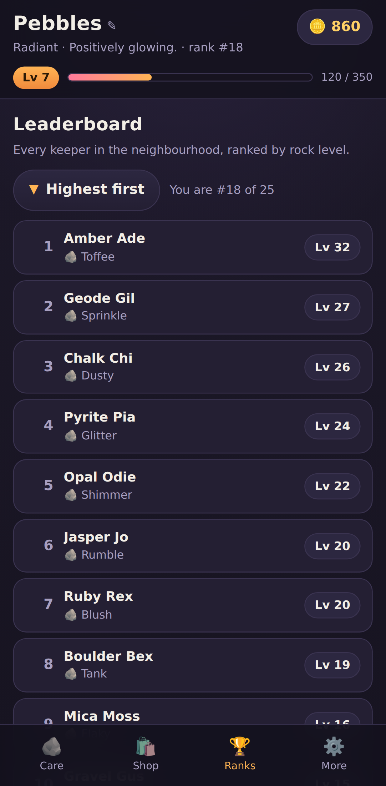

# 🪨 Pet Rock Simulator

A digital pet — but it's a rock. Scrub it, polish it, play with it and water its
moss. Look after it and it levels up; forget about it and it levels right back
down. Earn coins, dress it up in the boutique, and see where you land on the
leaderboard.

It's a **PWA**: one small web app that installs to the home screen or desktop on
**Windows, Android and iOS**, and keeps working with no connection.

<p align="center">
  
  
</p>

---

## Install it

The app has to be served over **https** (or `localhost`) to be installable —
GitHub Pages is the easy option, see [Deploying](#deploying) below. Once it's at
a URL:

| Platform | How |
| --- | --- |
| **Android** (Chrome, Edge, Samsung Internet) | Open the URL → tap the **Install** button in the app's *More* tab, or browser menu ⋮ → **Install app / Add to Home screen**. |
| **iPhone / iPad** (Safari — required, Chrome and Firefox on iOS can't install web apps) | Open the URL in **Safari** → **Share** ⬆️ → **Add to Home Screen** → **Add**. |
| **Windows** (Chrome, Edge) | Open the URL → click the **install icon** in the address bar, or menu ⋮ → **Apps → Install this site as an app**. It gets its own window and a Start-menu entry. |
| **macOS / Linux** (Chrome, Edge) | Same as Windows — install icon in the address bar. |

Installed, it launches full screen, keeps its own save, and runs offline. Your
rock keeps ageing while the app is closed, so it will need attention when you
come back.

## How to play

**Four needs** drain continuously — in real time, whether the app is open or not:

| Need | Action | Drains |
| --- | --- | --- |
| 🧼 Clean | 🧽 Scrub | 4.5 %/hour |
| ✨ Shine | 🪄 Polish | 5.0 %/hour |
| 💛 Joy | 🎲 Play | 5.5 %/hour |
| 🌿 Moss | 💧 Water | 3.5 %/hour |

**Levels go up and down.** Your care score is the average of the four needs.
Above 55 % the rock gains XP and levels up; below it, XP drains and levels are
lost. Perfect care is +30 XP/hour, total neglect is −14 XP/hour. Coming back
after days away costs at most 24 hours' worth of damage, so a holiday won't wipe
you out — but it will hurt.

**Coins** come from care actions (only for points actually restored — spamming a
full bar earns nothing), from every level-up, and from a daily check-in streak.

**Cosmetics** — 30 items across five slots: rock types, eyes, hats, extras and
scenes. Buy once, wear forever, swap any time. Expensive items also need a
minimum level.

**Leaderboard** — every keeper in the neighbourhood ranked by level, with a
button to flip between **highest first** and **lowest first**. Your own row is
highlighted wherever it lands.

> The rival keepers are **simulated on your device**. The game has no server and
> no accounts: nothing you do is uploaded, and nobody else can see your rock.
> Rivals are generated from a fixed seed plus the calendar date, so they're the
> same for everyone, stable through the day, and slowly climbing over time.

## Run it locally

```bash
npm start          # http://localhost:8080  (no dependencies)
```

Opening `index.html` straight off disk mostly works, but service workers and the
manifest need a real origin, so use the dev server for anything install- or
offline-related.

```bash
npm test           # 23 unit tests covering the game rules
npm run icons      # regenerate the PNG icon set (needs python3)
```

## Deploying

`.github/workflows/pages.yml` runs the tests and publishes the repo to GitHub
Pages on every push to the default branch. It needs one manual step first,
because the Pages source can only be set by a repository admin:

1. **Settings → Pages → Build and deployment → Source: _GitHub Actions_**
   ([direct link](https://github.com/Jack-O-VScode/My-Game/settings/pages))
2. Push anything (or **Actions → Deploy to GitHub Pages → Run workflow**).

The site then goes live at **https://jack-o-vscode.github.io/My-Game/** —
public, free, HTTPS, no server to run. Every path in the app is relative, so
serving from a `/My-Game/` subdirectory works fine.

**Custom domain:** buy a domain, point a `CNAME` record at
`jack-o-vscode.github.io`, and set it under Settings → Pages → Custom domain.
Leave *Enforce HTTPS* on — installing a PWA requires it.

Any static host works just as well — Netlify, Vercel, Cloudflare Pages, S3 —
since there is no build step and no backend. Drag the folder into
[app.netlify.com/drop](https://app.netlify.com/drop) and it's online in seconds.

## Layout

```
index.html              markup shell
styles.css              one dark theme, mobile first
manifest.webmanifest    PWA metadata (name, icons, colours)
sw.js                   service worker: precaches the shell for offline play
js/
  config.js             tuning constants + the cosmetics catalogue
  engine.js             pure game rules: decay, XP, levels, coins, shop
  leaderboard.js        seeded rival generation + sorting
  render.js             draws the rock as layered SVG
  storage.js            guarded localStorage save/load
  sfx.js                WebAudio blips, no audio assets
  ui.js                 DOM rendering and event wiring
  main.js               controller: clock, handlers, install flow
tests/engine.test.js    node --test, no dependencies
tools/
  make_icons.py         generates the icon PNGs from scratch
  serve.js              dependency-free static dev server
```

The rules live in `js/engine.js` as pure functions — no DOM, no timers — which
is what makes them straightforward to test. Want a harsher game? Change
`TUNING` in `js/config.js`. New cosmetic? Add an entry to `COSMETICS` with an
SVG fragment drawn in the 240×200 scene space; the shop, previews and renderer
pick it up automatically.

## Saves

Everything lives in one `localStorage` key (`pet-rock-sim`). Corrupt or partial
saves are repaired on load rather than crashing, timestamps from the future
can't bank free progress, and if storage is blocked entirely (private mode) the
game still runs — it just won't remember. *Start over* in the **More** tab wipes
the save.
